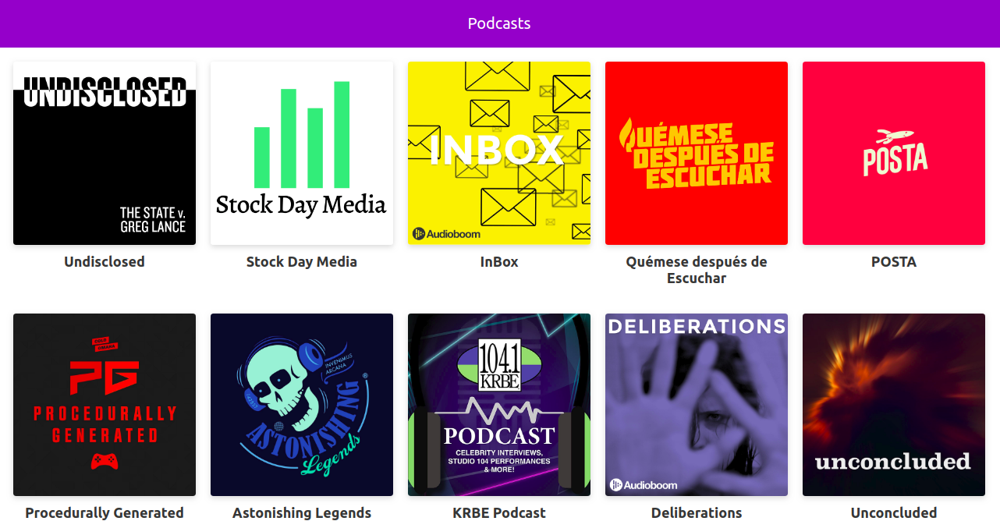

# App desarrollada en Next-JS

## - requerimientos

* nodeJS version 10 en adelante

* npm version 6.10 en adelante

## descargar repositorio

git clone git@github.com:enmanuelCastillo5/podcast.git
// clona el repositorio

### isntala todas las dependencias
npm install

## ejecuta el script para desarrollo o produccion

`npm run dev` - desarrollo
`npm run build && run start` - produccion

## License
MIT

### version web

### version movil
